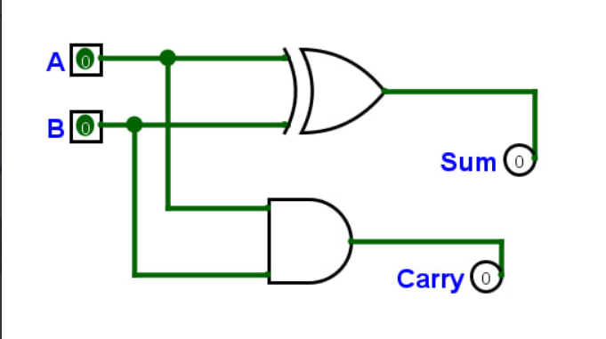
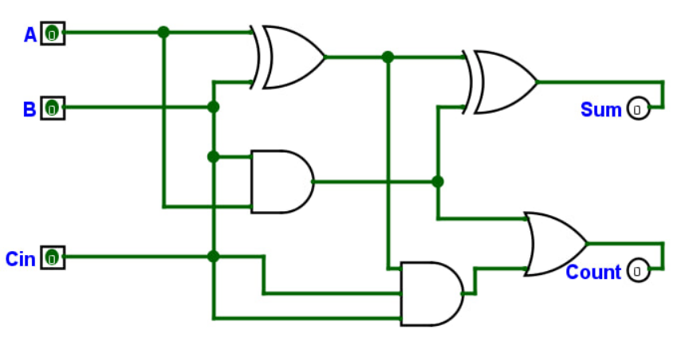
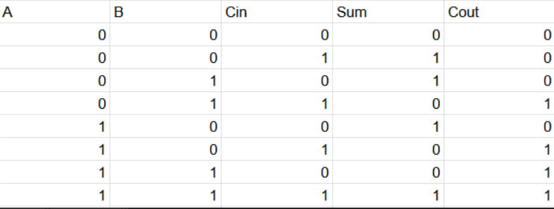
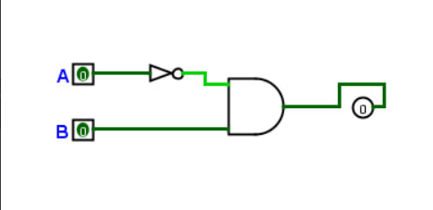

# Практична робота №2
## Студент: Нефьодов Нікіта
## Група: ІПЗ-4/2
## Варіант №11

## 1. Півсуматор

## 2. Повний суматор

## 3. Синтез комбінаційної схеми за Варіантом 11

## Висоновок
Під час виконання практичної роботи було опановано роботу з програмою Logisim Evolution, побудовано та перевірено базові комбінаційні вузли: півсуматор, повний суматор та мультиплексор 2-в-1. За вихідними даними Варіанту 11 було складено таблицю істинності, записано ДДНФ функції та побудовано її комбінаційну схему.